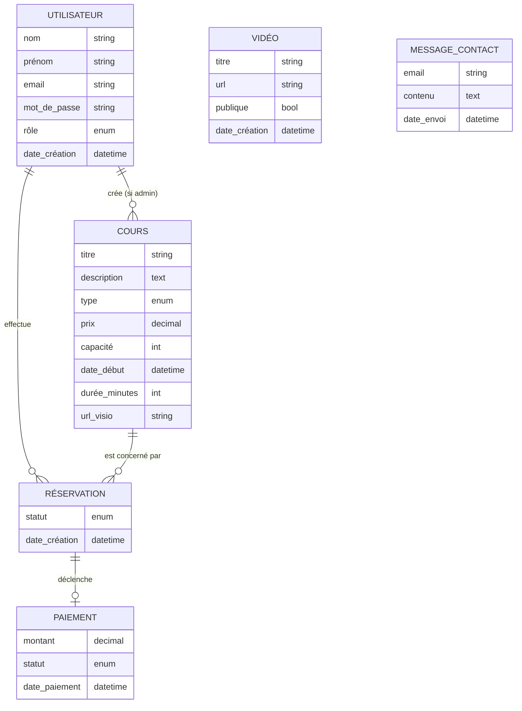

# Modèles Merise — Jasmine Teacher

Application de la méthode **Merise** au projet, en 3 niveaux : MCD → MLD → MPD.

> Note : la conception réelle a été faite directement en MPD (dans `database.sql`). Ce document **rétroconstruit** les niveaux supérieurs à partir du physique pour respecter la méthodologie.

---

## 1. MCD — Modèle Conceptuel de Données

Représentation des **entités** métier et de leurs **associations**, indépendamment de l'implémentation.



### Cardinalités Merise

| Association | Côté A | Côté B | Lecture |
|---|---|---|---|
| `UTILISATEUR — crée — COURS` | (0,N) | (1,1) | Un utilisateur (admin) peut créer 0 ou N cours. Un cours a forcément 1 créateur. |
| `UTILISATEUR — effectue — RÉSERVATION` | (0,N) | (1,1) | Un utilisateur effectue 0 ou N réservations. Une réservation appartient à 1 utilisateur. |
| `COURS — concerne — RÉSERVATION` | (0,N) | (1,1) | Un cours peut avoir 0 ou N réservations. Une réservation porte sur 1 cours. |
| `RÉSERVATION — déclenche — PAIEMENT` | (0,1) | (1,1) | Une réservation peut avoir 0 ou 1 paiement. Un paiement est lié à 1 réservation. |

### Règles de gestion (RG)

| RG | Énoncé |
|---|---|
| RG1 | Un utilisateur s'inscrit en tant que `student` par défaut. Seul l'admin peut promouvoir un utilisateur au rôle `admin`. |
| RG2 | Une réservation n'est possible qu'au minimum **7 jours** avant la date du cours. |
| RG3 | Le nombre de réservations actives d'un cours ne peut dépasser sa `capacité`. |
| RG4 | Un même utilisateur ne peut pas avoir deux réservations actives sur le même cours. |
| RG5 | Le prix payé est toujours recalculé côté serveur depuis le cours (jamais transmis par le client). |
| RG6 | Une réservation passe en `confirmed` uniquement après un paiement réussi (Stripe ou mock). |
| RG7 | Une vidéo `is_public=false` n'est accessible qu'aux utilisateurs connectés. |

---

## 2. MLD — Modèle Logique de Données

Transformation du MCD en **schéma relationnel**. Chaque entité devient une table ; chaque association `(0,N) — (1,1)` migre la clé via une FK.

```text
USERS (
  id              [PK]
  lastname        VARCHAR
  firstname       VARCHAR
  email           VARCHAR  [UNIQUE]
  password_hash   VARCHAR
  role            ENUM('student', 'admin')
  created_at      DATETIME
)

COURSES (
  id              [PK]
  title           VARCHAR
  description     TEXT
  type            ENUM('collectif', 'individuel', 'enfant_collectif', 'enfant_individuel')
  price           DECIMAL
  capacity        INT
  start_at        DATETIME
  duration_minutes INT
  visio_url       VARCHAR
  created_by      [FK → USERS.id]
)

BOOKINGS (
  id              [PK]
  user_id         [FK → USERS.id]
  course_id       [FK → COURSES.id]
  status          ENUM('pending', 'confirmed', 'cancelled')
  created_at      DATETIME
  [UNIQUE (user_id, course_id)]
)

PAYMENTS (
  id              [PK]
  booking_id      [FK → BOOKINGS.id]
  amount          DECIMAL
  status          ENUM('pending', 'paid', 'refunded')
  paid_at         DATETIME
)

VIDEOS (
  id              [PK]
  title           VARCHAR
  url             VARCHAR
  is_public       BOOLEAN
  created_at      DATETIME
)

CONTACT_MESSAGES (
  id              [PK]
  email           VARCHAR  [NULLABLE]
  message         TEXT
  created_at      DATETIME
)
```

### Conventions de transformation

- Toute entité Merise → table relationnelle.
- Association `(0,N) — (1,1)` → la table du côté `(1,1)` reçoit la FK.
- Une association porteuse de cardinalités `(0,1) — (1,1)` peut être fusionnée — c'est ce qu'on a fait pour `RÉSERVATION — PAIEMENT` (la FK `booking_id` vit dans `PAYMENTS`).
- Pas d'association N-N dans ce modèle → pas besoin de table de liaison.

---

## 3. MPD — Modèle Physique de Données

Implémentation **réelle** en MySQL 8 / TiDB 8.5 (compatible MySQL). Fichier source : `database.sql`.

```sql
CREATE TABLE IF NOT EXISTS users (
  id INT PRIMARY KEY AUTO_INCREMENT,
  lastname VARCHAR(100) NOT NULL,
  firstname VARCHAR(100) NOT NULL,
  email VARCHAR(255) NOT NULL UNIQUE,
  password_hash VARCHAR(255) NOT NULL,
  role ENUM('student', 'admin') NOT NULL DEFAULT 'student',
  created_at DATETIME DEFAULT CURRENT_TIMESTAMP
);

CREATE TABLE IF NOT EXISTS courses (
  id INT PRIMARY KEY AUTO_INCREMENT,
  title VARCHAR(200) NOT NULL,
  description TEXT,
  type ENUM('collectif', 'individuel', 'enfant_collectif', 'enfant_individuel') NOT NULL,
  price DECIMAL(6, 2) NOT NULL,
  capacity INT NOT NULL DEFAULT 10,
  start_at DATETIME NOT NULL,
  duration_minutes INT NOT NULL DEFAULT 60,
  visio_url VARCHAR(500),
  created_by INT NOT NULL,
  FOREIGN KEY (created_by) REFERENCES users(id) ON DELETE CASCADE
);

CREATE TABLE IF NOT EXISTS bookings (
  id INT PRIMARY KEY AUTO_INCREMENT,
  user_id INT NOT NULL,
  course_id INT NOT NULL,
  status ENUM('pending', 'confirmed', 'cancelled') NOT NULL DEFAULT 'pending',
  created_at DATETIME DEFAULT CURRENT_TIMESTAMP,
  UNIQUE KEY uniq_user_course (user_id, course_id),
  FOREIGN KEY (user_id) REFERENCES users(id) ON DELETE CASCADE,
  FOREIGN KEY (course_id) REFERENCES courses(id) ON DELETE CASCADE
);

CREATE TABLE IF NOT EXISTS payments (
  id INT PRIMARY KEY AUTO_INCREMENT,
  booking_id INT NOT NULL,
  amount DECIMAL(6, 2) NOT NULL,
  status ENUM('pending', 'paid', 'refunded') NOT NULL DEFAULT 'pending',
  paid_at DATETIME,
  FOREIGN KEY (booking_id) REFERENCES bookings(id) ON DELETE CASCADE
);

CREATE TABLE IF NOT EXISTS videos (
  id INT PRIMARY KEY AUTO_INCREMENT,
  title VARCHAR(200) NOT NULL,
  url VARCHAR(500) NOT NULL,
  is_public BOOLEAN NOT NULL DEFAULT TRUE,
  created_at DATETIME DEFAULT CURRENT_TIMESTAMP
);

CREATE TABLE IF NOT EXISTS contact_messages (
  id INT PRIMARY KEY AUTO_INCREMENT,
  email VARCHAR(255),
  message TEXT NOT NULL,
  created_at DATETIME DEFAULT CURRENT_TIMESTAMP
);
```

### Choix techniques notables au MPD

| Choix | Justification |
|---|---|
| `INT AUTO_INCREMENT` pour les PK | Compromis perf/simplicité, suffisant à l'échelle du projet |
| `VARCHAR(255)` pour les emails | Limite RFC 5321 |
| `ENUM` pour `role`, `type`, `status` | Plus économique en stockage qu'un VARCHAR libre, et auto-validé par MySQL |
| `DECIMAL(6,2)` pour les prix | Évite les imprécisions du flottant (40.00, jamais 40.0000001) |
| `ON DELETE CASCADE` sur les FK | Simplifie la suppression d'un user : ses bookings/courses/paiements disparaissent |
| `UNIQUE(user_id, course_id)` sur `bookings` | Implémente la RG4 au niveau base, robuste aux courses condition |
| Pas de tables d'index secondaire | Volumes prévus < 10k lignes, le scan est acceptable |

---

## 4. Couverture du CRUD par les modules

Chaque table du MPD a un module backend complet selon le pattern Action / Repository / Routes :

| Table | C | R | U | D | Module backend |
|---|---|---|---|---|---|
| `users` | POST /auth/register | GET /users | PUT /users/:id | DELETE /users/:id | `auth/` + `users/` |
| `courses` | POST /courses | GET /courses, GET /courses/:id | PUT /courses/:id | DELETE /courses/:id | `courses/` |
| `bookings` | POST /bookings | GET /bookings/me, GET /bookings/all | PUT /bookings/:id | DELETE /bookings/:id | `bookings/` |
| `payments` | POST /payments + Stripe | GET /payments | PUT /payments/:id/refund | — (trace immuable) | `payments/` |
| `videos` | POST /videos | GET /videos, GET /videos/all | PUT /videos/:id | DELETE /videos/:id | `videos/` |
| `contact_messages` | POST /contact | GET /contact | — (pas de modification) | DELETE /contact/:id | `contact/` |

---

## 5. Cohérence Merise ↔ User Stories

| US (cf `infos/User Stories.pdf`) | Niveau touché | Opération MPD |
|---|---|---|
| US3 Visiteur crée un compte | UTILISATEUR | `INSERT INTO users` |
| US5 Élève se connecte | UTILISATEUR | `SELECT FROM users WHERE email` + bcrypt verify |
| US6 Élève réserve un cours | RÉSERVATION (+ vérif COURS) | `INSERT INTO bookings` après contrôle RG2/RG3/RG4 |
| US7 Élève paie un cours | PAIEMENT (+ MAJ RÉSERVATION) | `INSERT INTO payments` + `UPDATE bookings SET status='confirmed'` |
| US10 Élève annule | RÉSERVATION | `UPDATE bookings SET status='cancelled'` |
| US11 Admin crée un cours | COURS | `INSERT INTO courses` |
| US12 Admin modifie/supprime | COURS | `UPDATE courses` / `DELETE FROM courses` |
| US13 Admin liste les élèves | UTILISATEUR | `SELECT FROM users` (sans password_hash) |
| US14 Admin gère paiements | PAIEMENT | `SELECT FROM payments` + refund |
| US15 Admin ajoute une vidéo | VIDÉO | `INSERT INTO videos` |

---

## 6. Vérification

```bash
# Importer le MPD dans une base MySQL fraîche
mysql -u root -p < database.sql

# Vérifier qu'on a les 6 tables attendues
mysql -u root -D jasmine_teacher -e "SHOW TABLES;"
# bookings, contact_messages, courses, payments, users, videos
```

Cohérent avec le MLD.
