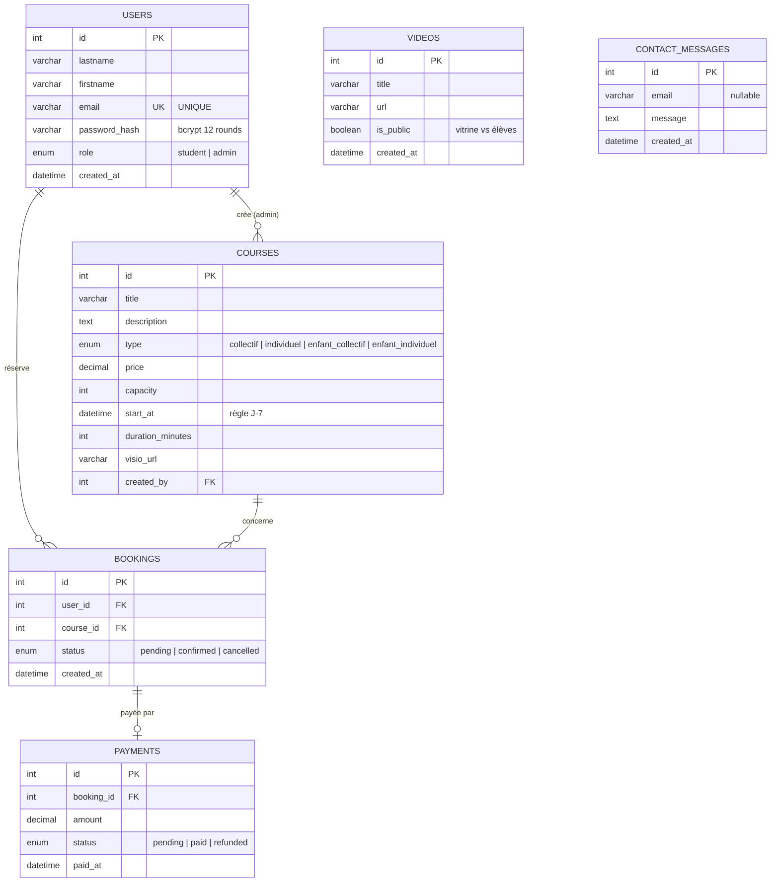
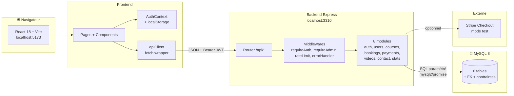
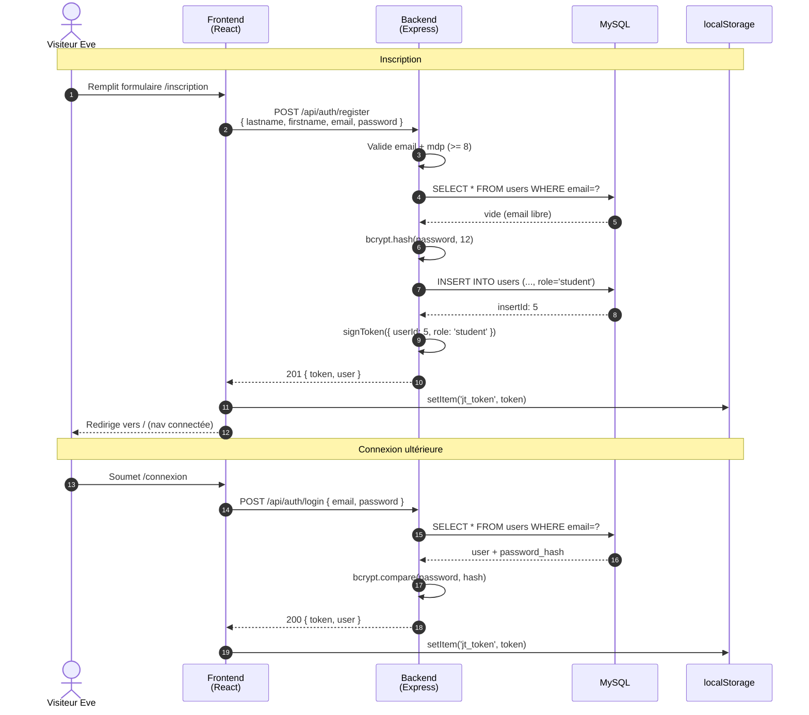
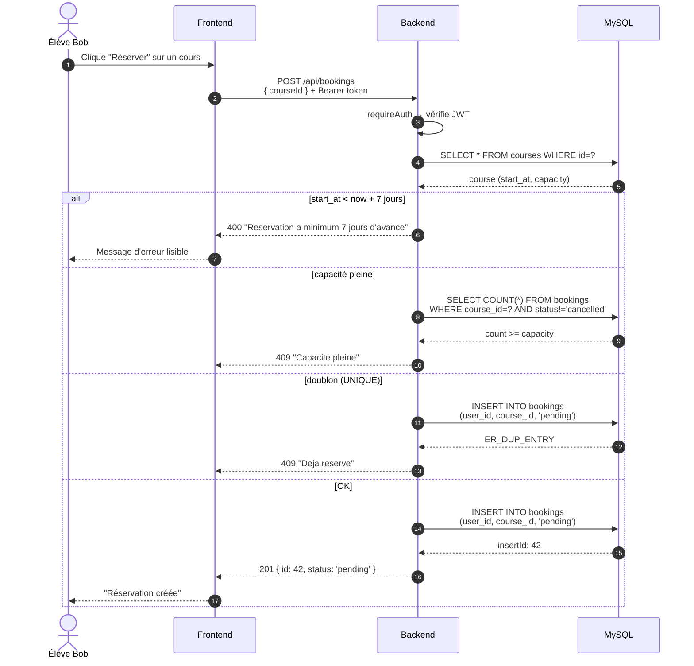
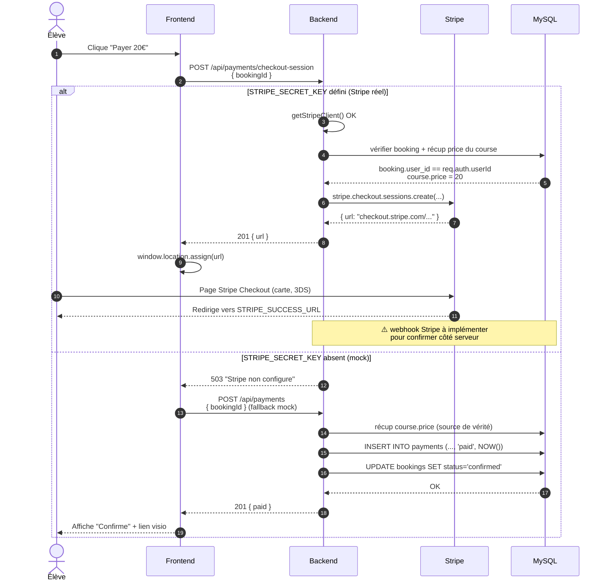
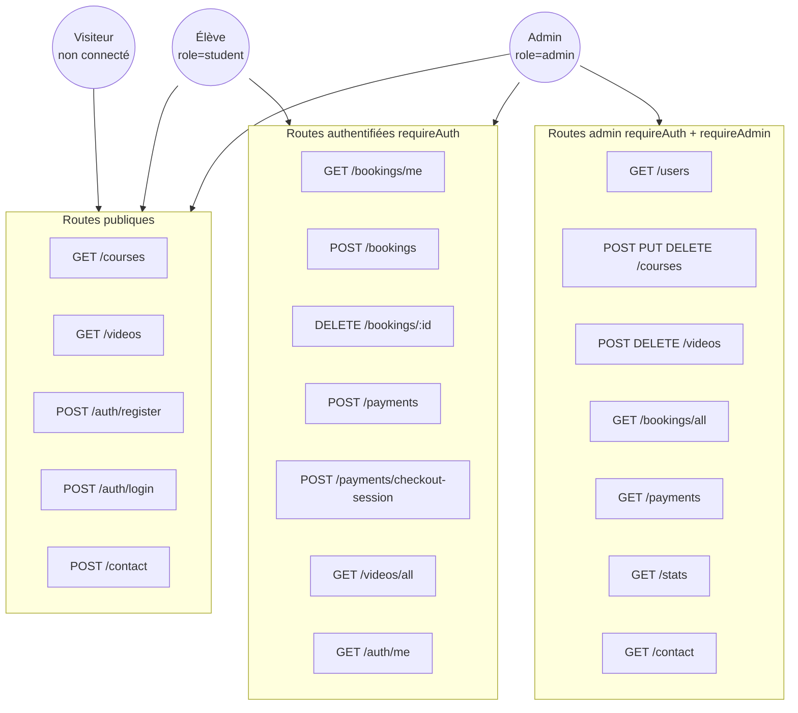
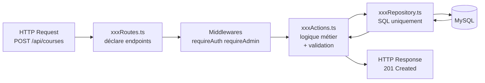
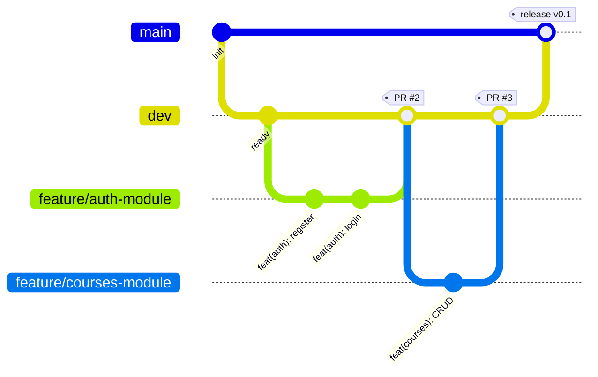
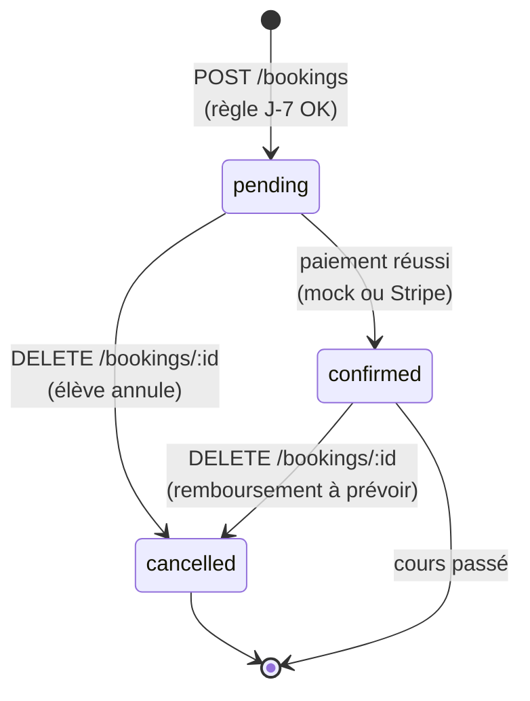
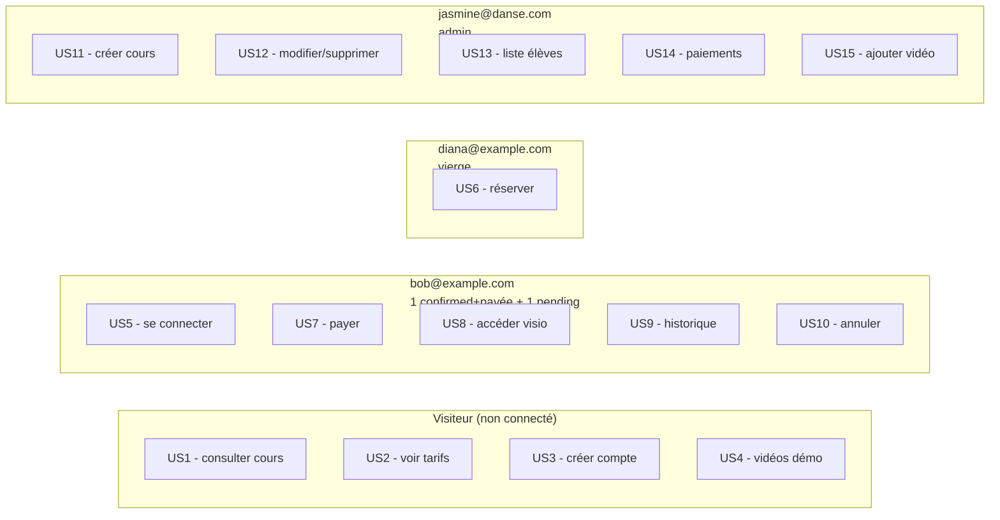

# Schémas — Jasmine Teacher

Tous les schémas du projet en **Mermaid** (rendu natif par GitHub). Ouvre ce fichier directement sur GitHub pour voir les diagrammes ; en local, n'importe quel rendu Markdown qui supporte Mermaid (VS Code + extension, Typora, Obsidian…) les affichera.

---

## 1. Modèle de données (Entity Relationship)

Les 6 tables MySQL avec leurs relations et contraintes.



**Contraintes notables** :

- `bookings` a un `UNIQUE(user_id, course_id)` → 1 booking max par couple élève/cours
- Toutes les FK avec `ON DELETE CASCADE` → suppression en chaîne (pas d'orphelin)
- `password_hash` n'est jamais renvoyé au client (sélection explicite des colonnes)

---

## 2. Architecture globale

Vue d'ensemble des composants et de leurs flux de communication.



---

## 3. Flow d'inscription puis connexion



---

## 4. Flow de réservation d'un cours

Avec les 2 règles métier (capacité + J-7) appliquées côté serveur.



---

## 5. Flow de paiement — Stripe vs mock

Le front tente d'abord Stripe Checkout, fallback automatique sur le mock si Stripe pas configuré.



---

## 6. Rôles et permissions

Qui peut accéder à quelles routes ? Tableau condensé sous forme de graphe.



---

## 7. Le pattern Action / Repository / Routes

C'est le pattern dominant côté backend. Chaque module suit cette structure.



**Règles** :

- Les **Routes** ne contiennent **aucune logique** (juste `.post(path, ...mw, action)`)
- Les **Actions** ne touchent **jamais directement** à `pool.query` — toujours via le Repository
- Les **Repositories** ne lisent **jamais** `req.body` — ils reçoivent des paramètres typés

---

## 8. Pipeline CI/CD (GitHub Actions)

Déclenché à chaque PR ou push sur `dev` ou `main`.

```mermaid
flowchart LR
    Trigger{pull_request<br/>ou push<br/>vers dev / main}
    Checkout[actions/checkout@v4]
    Setup[Setup Node 20<br/>+ cache npm]
    Install[npm install]
    Lint[npm run lint<br/>Biome]
    Test[npm test<br/>Vitest]
    Build[npm run build<br/>TypeScript / Vite]
    Pass([✅ Merge possible])
    Fail([❌ PR bloquée])

    Trigger --> Checkout
    Checkout --> Setup
    Setup --> Install
    Install --> Lint
    Lint -->|OK| Test
    Lint -->|KO| Fail
    Test -->|OK| Build
    Test -->|KO| Fail
    Build -->|OK| Pass
    Build -->|KO| Fail
```

Durée typique : **20–26 secondes**.

---

## 9. Workflow Git

Branches et flux d'intégration.



**Règles** :

- Push direct interdit sur `main` et `dev`.
- Tout passe par une **PR** vers `dev` (avec CI verte + review).
- `dev → main` chaque fin de semaine (livraison fréquente).
- Branches : `feature/*`, `fix/*`, `docs/*`, `chore/*`, `test/*`, `ci/*`.

---

## 10. Cycle de vie d'une réservation

États possibles d'une `booking` au cours du temps.



---

## 11. Couverture des 15 User Stories

Quels comptes du seed permettent de tester chaque US.



---

> 💡 **Astuce démo** : `INSTALL.md` détaille les identifiants et la procédure. `ONBOARDING.md` explique la logique métier en français pour quelqu'un qui découvre le projet.
